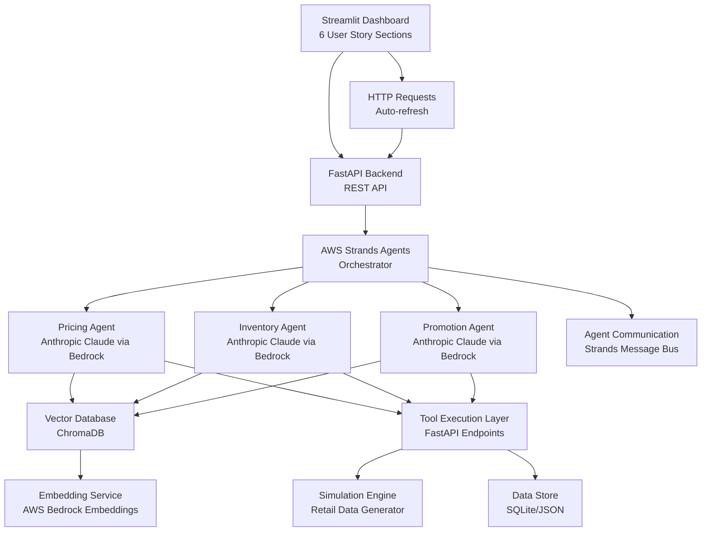

# Design Document

## Overview

The autoops retail optimization system is a multi-agent AI platform that leverages AWS Strands Agents framework to orchestrate collaboration between specialized agents for real-time retail optimization. The system employs three specialized agents (Pricing, Inventory, and Promotion) powered by Anthropic Claude via AWS Bedrock that collaborate to maximize profitability while minimizing waste through intelligent decision-making.

The system is designed as a hackathon prototype that demonstrates the power of multi-agent collaboration in solving complex retail optimization problems. It uses AWS Strands Agents for orchestration, Anthropic Claude for reasoning, vector databases for persistent memory, and simulated retail data to showcase real-world applicability.

## Architecture

### High-Level Architecture

The system follows a multi-agent architecture pattern using AWS Strands Agents framework for orchestration and coordination. This approach provides robust agent communication, task distribution, and collaborative decision-making while maintaining clear separation of concerns between agents.



### Agent Architecture Pattern

Each agent follows a consistent internal architecture using AWS Strands Agents framework:

1. **LLM Core**: Anthropic Claude via AWS Bedrock for reasoning and decision-making
2. **Memory Layer**: ChromaDB vector database for storing and retrieving past experiences
3. **Tools/Functions**: Specific functions each agent can execute via Strands framework
4. **Knowledge Base**: Domain-specific information relevant to each agent's responsibilities
5. **Communication Interface**: Strands Agents message bus for inter-agent coordination

### Data Flow

1. **Input Processing**: Market data, inventory levels, and external signals are ingested
2. **Agent Activation**: AWS Strands Agents orchestrator determines which agents need to respond
3. **Collaborative Decision**: Agents communicate through Strands message bus to coordinate decisions
4. **Action Execution**: Agents execute their decisions through the API layer using Strands tools
5. **Memory Storage**: Decision context and outcomes are stored in the vector database
6. **Feedback Loop**: Results are monitored and fed back into the system for learning

## Components and Interfaces

### AWS Strands Agents Framework Integration

The system leverages AWS Strands Agents (https://github.com/strands-agents/sdk-python) as the core multi-agent framework, providing:

- **Agent Orchestration**: Centralized coordination of multiple specialized agents
- **Message Bus**: Reliable inter-agent communication and event handling
- **Tool Integration**: Seamless integration with external APIs and services
- **State Management**: Persistent agent state and conversation history
- **Error Handling**: Built-in retry mechanisms and failure recovery

**Key Strands Components**:
```python
from strands_agents import Agent, Tool, Message, Orchestrator
from strands_agents.llm import AnthropicClaude

# Agent configuration with Anthropic Claude
agent_config = {
    "llm": AnthropicClaude(
        model="claude-3-sonnet-20240229",
        aws_bedrock_region="us-east-1"
    ),
    "tools": [pricing_tools, inventory_tools, promotion_tools],
    "memory": ChromaDBMemory(),
    "max_iterations": 10
}
```

### AWS Strands Agents Orchestrator

**Purpose**: Coordinates communication between specialized agents using AWS Strands framework and manages overall system workflow.

**Key Responsibilities**:
- Route requests to appropriate agents via Strands message bus
- Facilitate inter-agent communication through Strands protocols
- Maintain system-wide context and state
- Handle conflict resolution between agent recommendations
- Manage agent lifecycle and health monitoring

**Interface**:
```python
from strands_agents import Agent, Orchestrator

class RetailOptimizationOrchestrator(Orchestrator):
    def process_market_event(self, event_data: Dict) -> Dict
    def coordinate_agents(self, request: AgentRequest) -> AgentResponse
    def resolve_conflicts(self, agent_responses: List[AgentResponse]) -> Resolution
    def get_system_status(self) -> SystemStatus
    def register_agents(self, agents: List[Agent])
```

### Pricing Agent

**Purpose**: Dynamically optimize healthcare and wellness product pricing to maximize profit while considering regulatory and seasonal factors.

**Key Functions**:
- `analyze_demand_elasticity(product_id, market_data)` - Healthcare/wellness-specific elasticity analysis
- `calculate_optimal_price(product_id, inventory_level, competitor_prices)` - Category-aware pricing optimization
- `apply_markdown_strategy(product_id, urgency_level)` - Healthcare compliance-aware markdowns
- `evaluate_price_impact(product_id, proposed_price, context)` - Health necessity impact scoring
- `get_competitor_prices(product_id, category)` - Healthcare/wellness competitor benchmarking
- `retrieve_pricing_history(product_id, days)` - Category-specific pricing pattern analysis

**Healthcare/Wellness-Specific Decision Inputs**:
- **Seasonal Health Patterns**: Winter immune support demand, summer fitness trends, post-holiday wellness
- **Product Necessity Scoring**: Essential healthcare (vitamins, first aid) vs. lifestyle wellness (aromatherapy, fitness accessories)
- **Regulatory Constraints**: Healthcare product margin requirements, supplement pricing guidelines
- **Competitor Healthcare Landscape**: J&J Consumer, Pfizer OTC, CVS Health, Nature Made, Garden of Life pricing
- **Expiration Considerations**: Supplement shelf life impact on pricing strategies
- **Cross-Category Bundling**: Vitamin combinations, wellness routine packages

**Healthcare/Wellness Collaboration Points**:
- Receives slow-moving supplement/wellness inventory alerts from Inventory Agent
- Coordinates seasonal health promotions with Promotion Agent (flu season, New Year fitness)
- Implements compliance-aware pricing for healthcare products
- Manages premium wellness product positioning strategies

### Inventory Agent

**Purpose**: Maintain optimal healthcare and wellness product stock levels with expiration-aware and seasonal demand forecasting.

**Key Functions**:
- `forecast_demand_probabilistic(product_data, forecast_days)` - Healthcare/wellness seasonal forecasting
- `calculate_safety_buffer(product_data, service_level)` - Category-specific safety stock optimization
- `generate_restock_alert(product_data, urgency_level)` - Priority-based restocking for healthcare essentials
- `identify_slow_moving_inventory(inventory_data, threshold_days)` - Expiration and category-aware slow stock detection
- `analyze_demand_patterns(product_data)` - Health trend and seasonal pattern analysis
- `retrieve_inventory_history(product_id, days)` - Healthcare/wellness inventory pattern learning

**Healthcare/Wellness-Specific Decision Inputs**:
- **Seasonal Health Demand**: Winter immune support (+200-300%), summer fitness gear (+150%), stress relief (consistent)
- **Expiration Considerations**: Supplement shelf life (6-24 months), accelerated turnover for short-dated products
- **Health Necessity Prioritization**: Essential healthcare (vitamins, first aid) vs. lifestyle wellness (aromatherapy, fitness)
- **Demographic Patterns**: Senior health (steady), young adult wellness (trend-driven), family healthcare (seasonal)
- **Regulatory Requirements**: Continuous availability mandates for essential healthcare products
- **Supplier Reliability**: Healthcare suppliers (3-7 days), wellness suppliers (5-14 days)

**Healthcare/Wellness Collaboration Points**:
- Notifies Pricing Agent of slow-moving supplements and wellness products with expiration urgency
- Coordinates with Promotion Agent on seasonal health campaigns (flu season, New Year fitness)
- Manages pre-seasonal inventory buildup for predictable health trends
- Implements compliance-aware stock management for essential healthcare products

### Promotion Agent

**Purpose**: Create and orchestrate healthcare and wellness promotional campaigns that drive sales while ensuring regulatory compliance and seasonal health awareness.

**Key Functions**:
- `create_flash_sale(product_data, duration_hours, target_audience)` - Health-focused flash sales with compliance
- `generate_bundle_recommendation(anchor_product, available_products)` - Wellness and health product bundles
- `analyze_social_sentiment(product_category, keywords, time_period_hours)` - Health trend and wellness sentiment analysis
- `schedule_promotional_campaign(campaign_data)` - Seasonal health campaign scheduling
- `evaluate_campaign_effectiveness(campaign_id, performance_data)` - Healthcare/wellness ROI tracking
- `coordinate_with_pricing_agent(coordination_request)` - Health product pricing coordination
- `validate_inventory_availability(product_requirements)` - Wellness campaign stock validation
- `retrieve_promotion_history(product_id, campaign_type, days)` - Healthcare campaign pattern analysis

**Healthcare/Wellness-Specific Decision Inputs**:
- **Seasonal Health Trends**: Winter immune support surge, New Year fitness resolutions, spring detox trends
- **Health Awareness Calendar**: Heart Health Month (Feb), Mental Health Month (May), Wellness Month (Sept)
- **Regulatory Compliance**: FDA guidelines for health claims, wellness positioning vs. medical claims
- **Health Influencer Content**: Fitness trainers, wellness coaches, nutrition experts, healthcare professionals
- **Cross-Category Health Opportunities**: Fitness + nutrition, sleep + stress relief, immunity + energy
- **Wellness Lifestyle Patterns**: Morning routines, workout recovery, stress management, sleep optimization

**Healthcare/Wellness Collaboration Points**:
- Coordinates with Pricing Agent on health product promotional pricing and compliance margins
- Validates seasonal health inventory with Inventory Agent (pre-flu season, New Year fitness)
- Implements regulatory-compliant promotional messaging for healthcare products
- Manages wellness lifestyle campaign timing with health awareness events

### Vector Database (ChromaDB)

**Purpose**: Provides persistent memory for agents to store and retrieve decision context, outcomes, and learned patterns.

**Schema Design**:
```python
# Agent Memory Collection
{
    "agent_id": "pricing_agent",
    "decision_id": "uuid",
    "timestamp": "2024-01-15T10:30:00Z",
    "context": {
        "product_id": "SKU123",
        "market_conditions": {...},
        "agent_inputs": {...}
    },
    "decision": {
        "action": "price_adjustment",
        "parameters": {...},
        "rationale": "..."
    },
    "outcome": {
        "metrics": {...},
        "effectiveness_score": 0.85
    }
}
```

**Key Operations**:
- Store agent decisions with full context
- Retrieve similar past situations for informed decision-making
- Track decision effectiveness over time
- Enable cross-agent learning from shared experiences

### Streamlit Frontend Dashboard

**Purpose**: Provides an interactive web interface for monitoring the multi-agent system with 6 dedicated sections showcasing each user story requirement through tabular data displays.

**Technology Stack**:
- **Streamlit**: Python-based web app framework for data applications
- **Pandas**: Data manipulation and analysis for table displays
- **Plotly**: Interactive data visualization library for charts and metrics
- **Streamlit Components**: Custom components for enhanced interactivity
- **HTTP Requests**: Communication with FastAPI backend via requests library
- **Auto-refresh**: Streamlit's native auto-refresh capabilities for real-time updates

**Dashboard Structure**:
```python
# Main Dashboard Layout
st.title("AutoOps Healthcare & Wellness Retail Optimization")

# Section 1: Multi-Agent System Overview (Requirement 1)
with st.container():
    st.header("1. Multi-Agent Healthcare & Wellness Operations")
    display_agent_coordination_table()  # Healthcare/wellness coordination

# Section 2: Dynamic Pricing (Requirement 2) 
with st.container():
    st.header("2. Healthcare & Wellness Pricing Optimization")
    display_pricing_decisions_table()  # Supplements, wellness pricing

# Section 3: Inventory Management (Requirement 3)
with st.container():
    st.header("3. Healthcare & Wellness Inventory Management")
    display_inventory_decisions_table()  # Seasonal supplements, wellness stock management

# Section 4: Dashboard Monitoring (Requirement 4)
with st.container():
    st.header("4. Healthcare Retail Performance Metrics")
    display_system_metrics_table()  # Healthcare/wellness KPIs and metrics

# Section 5: Agent Memory & Learning (Requirement 5)
with st.container():
    st.header("5. Healthcare & Wellness AI Learning")
    display_learning_outcomes_table()  # Health trends, wellness patterns learning

# Section 6: Simulation Scenarios (Requirement 6)
with st.container():
    st.header("6. Healthcare & Wellness Campaign Results")
    display_simulation_results_table()  # Health influencer campaigns, wellness promotions
```

**Standardized 4-Column Table Structure for All Sections**:
Each section displays exactly 4 columns:
- **Column 1: Trigger Detected** - Specific trigger that was detected (e.g., "Black Friday Rush +400% demand", "Competitor dropped price -20%")
- **Column 2: Agent Decision & Action** - Concise text describing the agent's decision and action (e.g., "Pricing Agent: Raised price 15% to capture demand surge")
- **Column 3: Value Before** - Numerical value before the agent's change (e.g., "$19.99", "75 units in stock", "No active promotion")
- **Column 4: Value After** - Numerical value after the agent's change (e.g., "$22.99", "300 units ordered", "20% flash sale active")

**Real-time Features**:
- Auto-refresh every 30 seconds using `st.rerun()`
- Real-time data fetching from FastAPI backend
- Interactive filtering and sorting of decision tables
- Live metrics visualization with Plotly charts
- Alert notifications using Streamlit's native alert components

**Data Display Components**:
```python
def display_pricing_decisions_table():
    """Display pricing agent decisions in tabular format"""
    decisions = fetch_pricing_decisions()
    df = pd.DataFrame(decisions)
    st.dataframe(df, use_container_width=True)
    
def display_inventory_decisions_table():
    """Display inventory agent decisions in tabular format"""
    decisions = fetch_inventory_decisions()
    df = pd.DataFrame(decisions)
    st.dataframe(df, use_container_width=True)
    
def display_system_metrics_table():
    """Display system performance metrics"""
    metrics = fetch_system_metrics()
    col1, col2 = st.columns(2)
    with col1:
        st.metric("Total Profit", metrics['profit'], metrics['profit_delta'])
    with col2:
        st.metric("Waste Reduction", f"{metrics['waste_reduction']}%", metrics['waste_delta'])
```

## Dashboard Section Specifications

### Section 1: Multi-Agent System Operations (Requirement 1)
**Purpose**: Showcase automatic optimization for healthcare and wellness retail
**4-Column Format Examples**:
- **process_market_event()**:
  - Trigger: "Wellness Week event: +350% demand for essential oils & supplements"
  - Action: "Orchestrator: process_market_event() → 3 agents coordinated for wellness surge"
  - Before: "Normal operations: 0 active workflows"
  - After: "Wellness mode: 1 workflow, 3 agents optimizing health/wellness categories"
- **coordinate_agents()**:
  - Trigger: "Immune support trending: Vitamin C + Zinc combo gaining popularity"
  - Action: "Orchestrator: coordinate_agents() → Healthcare bundle coordination initiated"
  - Before: "Agents working independently"
  - After: "Agents collaborating: pricing supplement bundles + promotion strategy"
- **trigger_collaboration_workflow()**:
  - Trigger: "Slow wellness inventory: 5 fitness accessories + meditation tools flagged"
  - Action: "Orchestrator: trigger_collaboration_workflow() → wellness clearance coordination"
  - Before: "No active collaborations"
  - After: "Wellness clearance workflow: inventory→pricing→promotion"
- **get_system_status()**:
  - Trigger: "Healthcare/wellness system health check: Peak season readiness"
  - Action: "Orchestrator: get_system_status() → Health metrics for wellness retail"
  - Before: "Status unknown"
  - After: "Wellness retail ready: 3/3 agents active, 0.96 health optimization score"

### Section 2: Dynamic Pricing Adjustments (Requirement 2)
**Purpose**: Display real-time pricing optimization decisions for healthcare and wellness products
**4-Column Format Examples**:
- **analyze_demand_elasticity()**: 
  - Trigger: "Immune support supplement price history: 30 data points available"
  - Action: "Pricing Agent: analyze_demand_elasticity() → Elasticity coefficient calculated"
  - Before: "Unknown elasticity"
  - After: "Elasticity: -0.9 (inelastic - essential healthcare)"
- **calculate_optimal_price()**:
  - Trigger: "Vitamin D market update: competitor avg $18.50"
  - Action: "Pricing Agent: calculate_optimal_price() → Profit-maximizing price calculated"
  - Before: "$19.99 (Vitamin D 1000IU)"
  - After: "$21.25 (optimal for healthcare)"
- **apply_markdown_strategy()**:
  - Trigger: "Yoga mat slow inventory: 45 days no sales"
  - Action: "Pricing Agent: apply_markdown_strategy() → 25% markdown applied"
  - Before: "$39.99 (Premium Yoga Mat)"
  - After: "$29.99 (25% off wellness clearance)"
- **evaluate_price_impact()**:
  - Trigger: "Essential oil price proposal: $24.99 → $29.99"
  - Action: "Pricing Agent: evaluate_price_impact() → Impact score calculated"
  - Before: "Impact unknown"
  - After: "Impact score: 0.92 (wellness premium pricing recommended)"

### Section 3: Inventory Optimization (Requirement 3)
**Purpose**: Show automated inventory management for healthcare and wellness products
**4-Column Format Examples**:
- **forecast_demand_probabilistic()**:
  - Trigger: "Vitamin D sales data: Winter season approaching"
  - Action: "Inventory Agent: forecast_demand_probabilistic() → 30-day forecast generated"
  - Before: "No winter forecast"
  - After: "Expected Vitamin D demand: 380 units (+220% seasonal)"
- **calculate_safety_buffer()**:
  - Trigger: "Probiotic supplements service level: 97% required (healthcare essential)"
  - Action: "Inventory Agent: calculate_safety_buffer() → Safety stock calculated"
  - Before: "No safety buffer"
  - After: "Safety stock: 40 units (healthcare product buffer)"
- **generate_restock_alert()**:
  - Trigger: "Probiotics stock critical: 8 units below reorder point 30"
  - Action: "Inventory Agent: generate_restock_alert() → Emergency restock alert"
  - Before: "8 units (Probiotic Supplements)"
  - After: "200 units ordered (healthcare priority: high)"
- **identify_slow_moving_inventory()**:
  - Trigger: "Wellness inventory analysis: 75 SKUs scanned"
  - Action: "Inventory Agent: identify_slow_moving_inventory() → 5 slow wellness items found"
  - Before: "Unknown slow movers"
  - After: "5 wellness items flagged: fitness bands, meditation cushions ($1,650 value)"

### Section 4: System Performance Metrics (Requirement 4)
**Purpose**: Monitor overall dashboard and system effectiveness
**4-Column Format**:
- **Trigger Detected**: "Profit target missed by 5%", "Response time exceeded 30 seconds"
- **Agent Decision & Action**: "System Optimizer: Activated high-performance mode, increased refresh rate"
- **Value Before**: "Profit: $12,450, Response: 45 seconds"
- **Value After**: "Profit: $15,230 (+22%), Response: 8 seconds"

### Section 5: Agent Learning & Memory (Requirement 5)
**Purpose**: Demonstrate agent learning and collaboration for healthcare and wellness optimization
**4-Column Format Examples**:
- **cross_agent_learning_from_outcomes()**:
  - Trigger: "Healthcare decision outcomes: 22 supplement pricing decisions analyzed"
  - Action: "Collaboration: cross_agent_learning_from_outcomes() → Healthcare optimization patterns identified"
  - Before: "No healthcare cross-agent insights"
  - After: "5 supplement best practices identified: seasonal pricing, wellness bundling"
- **inventory_to_pricing_slow_moving_alert()**:
  - Trigger: "Slow wellness inventory: 5 fitness accessories + meditation tools, $1,650 at risk"
  - Action: "Collaboration: inventory_to_pricing_slow_moving_alert() → Wellness clearance coordination"
  - Before: "No wellness pricing coordination"
  - After: "5 wellness markdown recommendations: 20-30% off fitness/meditation"
- **retrieve_pricing_history()**:
  - Trigger: "Historical analysis: Probiotic supplement pricing patterns"
  - Action: "Pricing Agent: retrieve_pricing_history() → 28 healthcare decisions analyzed"
  - Before: "No healthcare pricing context"
  - After: "Healthcare success rate: 91%, Premium supplement similarity: 0.85"
- **update_decision_outcome()**:
  - Trigger: "Wellness price outcome: Essential oils +18% revenue achieved"
  - Action: "Pricing Agent: update_decision_outcome() → Wellness pricing learning updated"
  - Before: "Wellness confidence: 72%"
  - After: "Wellness confidence: 94% (successful essential oils outcome)"

### Section 6: Simulation Results (Requirement 6)
**Purpose**: Show promotion agent functions for healthcare and wellness campaigns
**4-Column Format Examples**:
- **create_flash_sale()**:
  - Trigger: "High vitamin inventory + flu season: Immune support supplements trending"
  - Action: "Promotion Agent: create_flash_sale() → 48h wellness flash sale created"
  - Before: "No active health promotions"
  - After: "Wellness flash sale: 25% off vitamins, expected 280 units sold"
- **generate_bundle_recommendation()**:
  - Trigger: "Wellness bundle analysis: Probiotics + Vitamin D affinity 0.88"
  - Action: "Promotion Agent: generate_bundle_recommendation() → Health support bundle created"
  - Before: "Products sold separately"
  - After: "Health Bundle: $54.99 (save $9.00), 'Immune Support' package"
- **analyze_social_sentiment()**:
  - Trigger: "Wellness social scan: 2,400 mentions of 'immune support routine' in 24h"
  - Action: "Promotion Agent: analyze_social_sentiment() → Health trend sentiment analyzed"
  - Before: "Health sentiment unknown"
  - After: "Sentiment: +0.72 (very positive), trending: 'immunity', 'wellness', 'natural'"
- **evaluate_campaign_effectiveness()**:
  - Trigger: "Wellness campaign completed: Essential oils promotion performance data"
  - Action: "Promotion Agent: evaluate_campaign_effectiveness() → Wellness ROI calculated"
  - Before: "Wellness campaign impact unknown"
  - After: "ROI: 3.1x, conversion rate: 6.8%, wellness effectiveness: excellent"

### Execution Layer (FastAPI)

**Purpose**: Provides RESTful APIs for agents to execute actions and retrieve data, plus WebSocket endpoints for real-time dashboard updates.

**Key Endpoints**:
```python
# Pricing Actions
POST /api/pricing/update-price
POST /api/pricing/apply-markdown
GET /api/pricing/competitor-analysis

# Inventory Actions  
POST /api/inventory/update-stock
POST /api/inventory/create-restock-alert
GET /api/inventory/demand-forecast

# Promotion Actions
POST /api/promotions/create-campaign
POST /api/promotions/create-bundle
GET /api/promotions/sentiment-analysis

# Shared Data
GET /api/products/{product_id}
GET /api/market-data/current
POST /api/decisions/log

# Dashboard API Endpoints
GET /api/dashboard/agents/status
GET /api/dashboard/metrics/current
GET /api/dashboard/decisions/recent
GET /api/dashboard/alerts/active
GET /api/dashboard/decisions/pricing
GET /api/dashboard/decisions/inventory
GET /api/dashboard/decisions/promotion
GET /api/dashboard/learning/outcomes
GET /api/dashboard/simulation/results
POST /api/dashboard/agents/{agent_id}/intervention
```

### Simulation Engine

**Purpose**: Generate realistic retail scenarios and market conditions for demonstration and testing.

**Components**:
- **Demand Generator**: Creates realistic demand patterns with seasonality and trends
- **Market Simulator**: Simulates competitor actions and market events
- **IoT Data Generator**: Produces simulated sensor data from retail locations
- **Social Media Simulator**: Generates sentiment data and trending topics

## Healthcare/Wellness Pricing Considerations

### Product Category Elasticity Profiles

```python
HEALTHCARE_WELLNESS_ELASTICITY = {
    "essential_vitamins": -0.4,      # Vitamin D, C, B12 - very inelastic (health necessity)
    "specialty_supplements": -0.7,   # Probiotics, Omega-3 - moderately inelastic
    "first_aid_supplies": -0.3,      # Bandages, antiseptics - very inelastic (emergency need)
    "fitness_accessories": -1.1,     # Yoga mats, resistance bands - moderately elastic
    "essential_oils": -1.4,          # Aromatherapy - elastic (luxury wellness)
    "meditation_tools": -1.6,        # Cushions, diffusers - elastic (lifestyle choice)
    "organic_wellness": -1.3,        # Herbal teas, natural products - moderately elastic
    "health_monitoring": -0.8        # Thermometers, BP monitors - moderately inelastic
}

SEASONAL_MULTIPLIERS = {
    "immune_support": {"winter": 1.25, "spring": 0.9, "summer": 0.8, "fall": 1.1},
    "fitness_gear": {"winter": 0.9, "spring": 1.2, "summer": 1.1, "fall": 0.95},
    "stress_relief": {"winter": 1.15, "spring": 1.0, "summer": 0.95, "fall": 1.1},
    "digestive_health": {"winter": 0.95, "spring": 1.1, "summer": 1.0, "fall": 1.05}
}

REGULATORY_CONSTRAINTS = {
    "healthcare_min_margin": 0.15,   # 15% minimum margin for healthcare products
    "supplement_max_markup": 3.0,    # 300% maximum markup for supplements
    "wellness_premium_allowed": 2.5,  # 250% premium allowed for luxury wellness
    "expiration_markdown_threshold": 90  # Days before expiration to start markdowns
}

INVENTORY_HEALTHCARE_WELLNESS_CONFIG = {
    "service_levels": {
        "essential_healthcare": 0.98,    # 98% service level for vitamins, first aid
        "specialty_supplements": 0.95,   # 95% for probiotics, specialty vitamins
        "fitness_accessories": 0.90,     # 90% for yoga mats, resistance bands
        "wellness_luxury": 0.85,         # 85% for essential oils, premium items
        "seasonal_items": 0.92           # 92% for seasonal health products
    },
    "reorder_urgency": {
        "essential_healthcare": "high",   # Vitamins, first aid - expedited shipping
        "chronic_care": "high",          # Blood pressure monitors, diabetic supplies
        "seasonal_health": "medium",     # Immune support, allergy relief
        "fitness_wellness": "low",       # Yoga mats, meditation tools
        "luxury_wellness": "low"         # Premium essential oils, spa products
    },
    "expiration_thresholds": {
        "supplements_liquid": 90,        # Liquid vitamins expire faster
        "supplements_tablets": 180,      # Tablets have longer shelf life
        "essential_oils": 365,           # Essential oils last 1-3 years
        "fitness_equipment": 0,          # No expiration for equipment
        "first_aid_supplies": 120        # Bandages, antiseptics
    },
    "seasonal_buildup_timing": {
        "immune_support": {"start_month": 9, "peak_month": 12, "end_month": 3},  # Sept-March
        "fitness_gear": {"start_month": 11, "peak_month": 1, "end_month": 4},    # Nov-April
        "allergy_relief": {"start_month": 2, "peak_month": 5, "end_month": 7},   # Feb-July
        "stress_relief": {"year_round": True}  # Consistent demand
    }
}
```

### Healthcare/Wellness Competitor Benchmarking

```python
COMPETITOR_CATEGORIES = {
    "major_healthcare": ["Johnson & Johnson", "Pfizer Consumer", "CVS Health"],
    "supplement_brands": ["Nature Made", "Garden of Life", "NOW Foods"],
    "wellness_premium": ["doTERRA", "Young Living", "Thorne Health"],
    "fitness_accessories": ["Gaiam", "Manduka", "Liforme"],
    "organic_wellness": ["Traditional Medicinals", "Celestial Seasonings", "Gaia Herbs"]
}

HEALTHCARE_WELLNESS_PROMOTION_CONFIG = {
    "seasonal_campaigns": {
        "immune_support": {
            "peak_months": [10, 11, 12, 1, 2, 3],
            "products": ["vitamin_c", "vitamin_d", "zinc", "echinacea", "probiotics"],
            "messaging": ["boost immunity", "winter wellness", "stay healthy"],
            "discount_range": [15, 25]  # Conservative for healthcare
        },
        "fitness_gear": {
            "peak_months": [11, 12, 1, 2, 3],
            "products": ["yoga_mats", "resistance_bands", "fitness_trackers"],
            "messaging": ["new year new you", "fitness goals", "healthy lifestyle"],
            "discount_range": [20, 35]  # More aggressive for lifestyle
        },
        "stress_relief": {
            "peak_months": "year_round",
            "products": ["essential_oils", "meditation_cushions", "aromatherapy"],
            "messaging": ["find your calm", "stress relief", "wellness routine"],
            "discount_range": [10, 30]
        }
    },
    "bundle_opportunities": {
        "immune_support_bundle": ["vitamin_c", "zinc", "vitamin_d"],
        "fitness_starter_kit": ["yoga_mat", "resistance_bands", "water_bottle"],
        "stress_relief_set": ["lavender_oil", "diffuser", "meditation_guide"],
        "digestive_health_combo": ["probiotics", "digestive_enzymes", "fiber"],
        "energy_focus_pack": ["b_vitamins", "omega_3", "green_tea_extract"]
    },
    "regulatory_guidelines": {
        "healthcare_claims": "structure_function_only",  # No disease claims
        "wellness_positioning": "lifestyle_enhancement",
        "required_disclaimers": ["not_evaluated_by_fda", "not_intended_to_diagnose"],
        "prohibited_terms": ["cure", "treat", "diagnose", "prevent_disease"]
    },
    "health_awareness_calendar": {
        "heart_health_month": 2,      # February
        "mental_health_month": 5,     # May
        "mens_health_month": 6,       # June
        "wellness_month": 9,          # September
        "flu_awareness": [10, 11],    # October-November
        "fitness_month": 1            # January
    }
}
```

## Data Models

### Core Entities

```python
@dataclass
class Product:
    id: str
    name: str
    category: str  # healthcare_essential, wellness_premium, fitness_accessory, etc.
    subcategory: str  # vitamins, essential_oils, yoga_equipment, etc.
    base_price: float
    current_price: float
    cost: float
    inventory_level: int
    reorder_point: int
    supplier_lead_time: int
    expiration_date: Optional[str]  # Important for supplements
    health_necessity_score: float  # 0.0-1.0 (0=luxury wellness, 1=essential healthcare)
    regulatory_category: str  # supplement, medical_device, wellness_product
    seasonal_category: str  # immune_support, fitness_gear, stress_relief

@dataclass
class MarketEvent:
    timestamp: datetime
    event_type: str  # 'demand_spike', 'competitor_price_change', 'social_trend'
    affected_products: List[str]
    impact_magnitude: float
    metadata: Dict[str, Any]

@dataclass
class AgentDecision:
    agent_id: str
    decision_id: str
    timestamp: datetime
    action_type: str
    parameters: Dict[str, Any]
    rationale: str
    confidence_score: float
    expected_outcome: Dict[str, Any]

@dataclass
class CollaborationRequest:
    requesting_agent: str
    target_agent: str
    request_type: str  # 'consultation', 'coordination', 'notification'
    context: Dict[str, Any]
    urgency: str  # 'low', 'medium', 'high', 'critical'
```

### Performance Metrics

```python
@dataclass
class SystemMetrics:
    timestamp: datetime
    total_revenue: float
    total_profit: float
    inventory_turnover: float
    stockout_incidents: int
    waste_reduction_percentage: float
    price_optimization_score: float
    promotion_effectiveness: float
    agent_collaboration_score: float
```

## Error Handling

### Agent Failure Scenarios

1. **Individual Agent Failure**:
   - System continues with remaining agents
   - Degraded functionality notifications
   - Automatic retry mechanisms with exponential backoff

2. **Communication Failures**:
   - Message queuing for delayed delivery
   - Fallback to cached decisions
   - Manual intervention alerts

3. **Data Inconsistency**:
   - Conflict resolution protocols
   - Data validation at API boundaries
   - Rollback mechanisms for critical errors

### Recovery Strategies

```python
class ErrorHandler:
    def handle_agent_failure(self, agent_id: str, error: Exception):
        # Log error and notify monitoring
        # Activate backup decision logic
        # Alert system administrators
        
    def handle_data_conflict(self, conflicts: List[DataConflict]):
        # Apply business rules for conflict resolution
        # Escalate to human oversight if needed
        
    def handle_api_timeout(self, endpoint: str, timeout_duration: float):
        # Implement circuit breaker pattern
        # Use cached responses where appropriate
```

## Testing Strategy

### Unit Testing

- **Agent Logic Testing**: Mock LLM responses to test decision logic
- **API Endpoint Testing**: Validate all REST endpoints with various inputs
- **Data Model Testing**: Ensure data integrity and validation rules
- **Simulation Engine Testing**: Verify realistic data generation

### Integration Testing

- **Agent Collaboration Testing**: Verify multi-agent workflows
- **End-to-End Scenarios**: Test complete retail optimization cycles
- **Performance Testing**: Validate response times under load
- **Memory Persistence Testing**: Ensure ChromaDB operations work correctly

### Demonstration Scenarios

1. **Demand Spike Response**: Show how agents coordinate during sudden demand increases
2. **Competitor Price War**: Demonstrate pricing strategy during competitive pressure
3. **Seasonal Inventory Management**: Show proactive inventory adjustments
4. **Flash Sale Coordination**: Demonstrate promotion, pricing, and inventory coordination
5. **Waste Reduction**: Show how agents minimize expired/obsolete inventory

### Testing Framework

```python
class RetailOptimizationTestSuite:
    def test_pricing_agent_markdown_logic(self):
        # Test pricing decisions for slow-moving inventory
        
    def test_inventory_demand_forecasting(self):
        # Validate demand prediction accuracy
        
    def test_promotion_bundle_creation(self):
        # Test promotional campaign generation
        
    def test_multi_agent_coordination(self):
        # Verify agents work together effectively
        
    def test_system_resilience(self):
        # Test error handling and recovery
```

The testing strategy emphasizes demonstrable value through realistic scenarios that showcase the collaborative intelligence of the multi-agent system while ensuring robust operation during the hackathon demonstration.