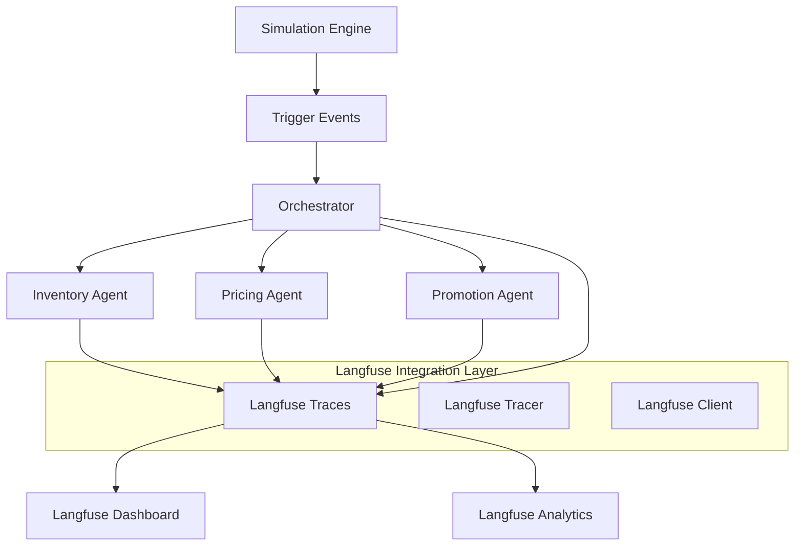

# Design Document

## Overview

This design integrates Langfuse observability platform into the AutoOps retail optimization system to provide comprehensive workflow visualization and monitoring of the multi-agent system. The integration will leverage Langfuse's Python SDK v3 (OpenTelemetry-based) to trace agent interactions, decision-making processes, and performance metrics triggered by the simulation engine.

## Architecture

### High-Level Architecture



### Integration Points

1. **Simulation Engine Triggers**: Capture simulation events as root traces
2. **Orchestrator Coordination**: Track inter-agent communication and workflow orchestration
3. **Agent Decision Making**: Trace individual agent reasoning and tool usage
4. **Agent Collaboration**: Monitor cross-agent workflows and conflict resolution
5. **Performance Metrics**: Aggregate system-wide performance data

## Components and Interfaces

### 1. Langfuse Integration Service

**Purpose**: Central service for managing Langfuse connections and trace coordination

**Key Components**:
- `LangfuseIntegrationService`: Main service class
- `TraceManager`: Manages trace lifecycle and context propagation
- `MetricsCollector`: Aggregates performance metrics
- `ConfigurationManager`: Handles Langfuse configuration and credentials

**Interface**:
```python
class LangfuseIntegrationService:
    def initialize(self, config: LangfuseConfig) -> bool
    def create_simulation_trace(self, event_data: Dict[str, Any]) -> str
    def start_agent_span(self, agent_id: str, operation: str, parent_trace_id: str) -> str
    def end_agent_span(self, span_id: str, outcome: Dict[str, Any]) -> None
    def log_agent_decision(self, decision: AgentDecision, trace_context: Dict[str, Any]) -> None
    def track_collaboration(self, workflow_id: str, participating_agents: List[str]) -> None
```

### 2. Agent Instrumentation Layer

**Purpose**: Instrument existing agents with Langfuse tracing without modifying core logic

**Key Components**:
- `AgentTracer`: Decorators and context managers for agent operations
- `ToolTracer`: Traces individual tool executions within agents
- `DecisionTracer`: Captures decision-making processes and outcomes

**Interface**:
```python
@observe(name="agent_operation")
def trace_agent_operation(agent_id: str, operation: str, context: Dict[str, Any]):
    # Existing agent logic remains unchanged
    pass

class ToolTracer:
    def trace_tool_execution(self, tool_name: str, inputs: Dict, outputs: Dict) -> None
    def capture_tool_performance(self, tool_name: str, execution_time: float) -> None
```

### 3. Simulation Event Tracer

**Purpose**: Capture simulation engine events as root traces for workflow visualization

**Key Components**:
- `SimulationEventCapture`: Intercepts simulation events
- `EventToTraceMapper`: Maps simulation events to Langfuse trace structure
- `TriggerTracker`: Tracks trigger propagation through the system

**Interface**:
```python
class SimulationEventCapture:
    def capture_trigger_event(self, trigger_data: Dict[str, Any]) -> str
    def track_event_propagation(self, event_id: str, agent_responses: List[Dict]) -> None
    def finalize_event_trace(self, event_id: str, final_outcome: Dict[str, Any]) -> None
```

### 4. Orchestrator Integration

**Purpose**: Trace orchestrator coordination and conflict resolution workflows

**Key Components**:
- `OrchestrationTracer`: Traces workflow coordination
- `ConflictResolutionTracer`: Monitors conflict detection and resolution
- `AgentCommunicationTracer`: Tracks inter-agent messages

**Interface**:
```python
class OrchestrationTracer:
    def trace_workflow_start(self, workflow_id: str, participating_agents: List[str]) -> str
    def trace_agent_coordination(self, coordination_id: str, messages: List[Dict]) -> None
    def trace_conflict_resolution(self, conflict_data: Dict[str, Any]) -> None
```

## Data Models

### Trace Structure

```python
@dataclass
class SimulationTrace:
    trace_id: str
    event_type: str
    trigger_source: str
    start_time: datetime
    end_time: Optional[datetime]
    participating_agents: List[str]
    event_data: Dict[str, Any]
    outcome: Optional[Dict[str, Any]]

@dataclass
class AgentSpan:
    span_id: str
    agent_id: str
    operation_type: str
    parent_trace_id: str
    start_time: datetime
    end_time: Optional[datetime]
    inputs: Dict[str, Any]
    outputs: Dict[str, Any]
    tools_used: List[str]
    decision_confidence: Optional[float]

@dataclass
class CollaborationSpan:
    span_id: str
    workflow_type: str
    participating_agents: List[str]
    coordination_messages: List[Dict[str, Any]]
    conflicts_detected: List[Dict[str, Any]]
    resolution_outcome: Optional[Dict[str, Any]]
```

### Metrics Schema

```python
@dataclass
class AgentPerformanceMetrics:
    agent_id: str
    operation_count: int
    average_response_time: float
    success_rate: float
    tool_usage_stats: Dict[str, int]
    decision_accuracy: float
    collaboration_score: float

@dataclass
class SystemWorkflowMetrics:
    total_events_processed: int
    average_workflow_duration: float
    agent_coordination_efficiency: float
    conflict_resolution_rate: float
    system_throughput: float
```

## Error Handling

### Error Categories

1. **Configuration Errors**: Invalid Langfuse credentials or connection issues
2. **Instrumentation Errors**: Failures in trace creation or span management
3. **Performance Errors**: High latency or resource consumption from tracing
4. **Data Errors**: Invalid trace data or serialization issues

### Error Handling Strategy

```python
class LangfuseErrorHandler:
    def handle_connection_error(self, error: Exception) -> None:
        # Graceful degradation - continue without tracing
        logger.warning(f"Langfuse connection failed: {error}")
        self.enable_fallback_mode()
    
    def handle_trace_error(self, trace_id: str, error: Exception) -> None:
        # Log error but don't interrupt agent operations
        logger.error(f"Trace {trace_id} failed: {error}")
        self.cleanup_failed_trace(trace_id)
    
    def handle_performance_degradation(self, latency_ms: float) -> None:
        # Implement sampling or disable tracing if performance impact is high
        if latency_ms > self.max_acceptable_latency:
            self.reduce_sampling_rate()
```

### Fallback Mechanisms

1. **Graceful Degradation**: System continues operating without tracing if Langfuse is unavailable
2. **Sampling**: Reduce trace volume if performance impact is detected
3. **Async Processing**: Use background queues for trace data to minimize impact on agent performance
4. **Local Buffering**: Buffer traces locally if Langfuse service is temporarily unavailable

## Testing Strategy

### Unit Testing

1. **Integration Service Tests**: Test Langfuse client initialization and configuration
2. **Tracer Tests**: Verify trace creation, span management, and context propagation
3. **Error Handling Tests**: Test fallback mechanisms and error recovery
4. **Performance Tests**: Measure tracing overhead and latency impact

### Integration Testing

1. **Agent Integration Tests**: Verify tracing works with existing agent implementations
2. **Simulation Integration Tests**: Test end-to-end tracing from simulation events to agent decisions
3. **Dashboard Integration Tests**: Verify traces appear correctly in Langfuse dashboard
4. **Multi-Agent Workflow Tests**: Test complex collaboration scenarios

### Performance Testing

1. **Latency Impact Tests**: Measure performance overhead of tracing
2. **Throughput Tests**: Verify system can handle high-frequency events with tracing enabled
3. **Memory Usage Tests**: Monitor memory consumption of trace data
4. **Scalability Tests**: Test tracing performance under load

### Test Data Strategy

```python
class TestDataGenerator:
    def generate_simulation_event(self, event_type: str) -> Dict[str, Any]
    def generate_agent_decision(self, agent_id: str) -> AgentDecision
    def generate_collaboration_workflow(self, agents: List[str]) -> Dict[str, Any]
    def create_test_trace_hierarchy(self, depth: int) -> List[Dict[str, Any]]
```

## Implementation Phases

### Phase 1: Core Integration (Week 1-2)
- Set up Langfuse client and configuration
- Implement basic trace creation for simulation events
- Add instrumentation to orchestrator

### Phase 2: Agent Instrumentation (Week 3-4)
- Add tracing to individual agents (Inventory, Pricing, Promotion)
- Implement tool-level tracing
- Add decision outcome tracking

### Phase 3: Collaboration Tracing (Week 5-6)
- Implement cross-agent workflow tracing
- Add conflict resolution monitoring
- Implement performance metrics collection

### Phase 4: Dashboard and Analytics (Week 7-8)
- Configure Langfuse dashboard views
- Implement custom metrics and alerts
- Add performance optimization and sampling

## Configuration Management

### Environment Variables

```bash
# Langfuse Configuration
LANGFUSE_PUBLIC_KEY=pk-lf-...
LANGFUSE_SECRET_KEY=sk-lf-...
LANGFUSE_HOST=https://cloud.langfuse.com
LANGFUSE_ENABLED=true

# Tracing Configuration
LANGFUSE_SAMPLE_RATE=1.0
LANGFUSE_DEBUG=false
LANGFUSE_FLUSH_INTERVAL=5
LANGFUSE_MAX_RETRIES=3

# Performance Configuration
LANGFUSE_MAX_LATENCY_MS=100
LANGFUSE_ENABLE_SAMPLING=true
LANGFUSE_BUFFER_SIZE=1000
```

### Configuration Schema

```python
@dataclass
class LangfuseConfig:
    public_key: str
    secret_key: str
    host: str = "https://cloud.langfuse.com"
    enabled: bool = True
    sample_rate: float = 1.0
    debug: bool = False
    flush_interval: int = 5
    max_retries: int = 3
    max_latency_ms: int = 100
    enable_sampling: bool = True
    buffer_size: int = 1000
```

## Security Considerations

1. **Credential Management**: Store Langfuse credentials securely using environment variables or secret management
2. **Data Privacy**: Implement data masking for sensitive information in traces
3. **Access Control**: Configure appropriate RBAC in Langfuse for different user roles
4. **Network Security**: Use HTTPS for all Langfuse communications
5. **Data Retention**: Configure appropriate data retention policies in Langfuse

## Monitoring and Alerting

### Key Metrics to Monitor

1. **Trace Success Rate**: Percentage of successfully created traces
2. **Tracing Latency**: Time overhead added by tracing operations
3. **Agent Performance Impact**: Change in agent response times with tracing enabled
4. **System Throughput**: Events processed per minute with tracing
5. **Error Rates**: Frequency of tracing errors or failures

### Alert Conditions

1. **High Latency**: Alert if tracing adds >100ms to agent operations
2. **Low Success Rate**: Alert if trace success rate drops below 95%
3. **Connection Issues**: Alert on Langfuse connectivity problems
4. **Performance Degradation**: Alert if system throughput drops >10%