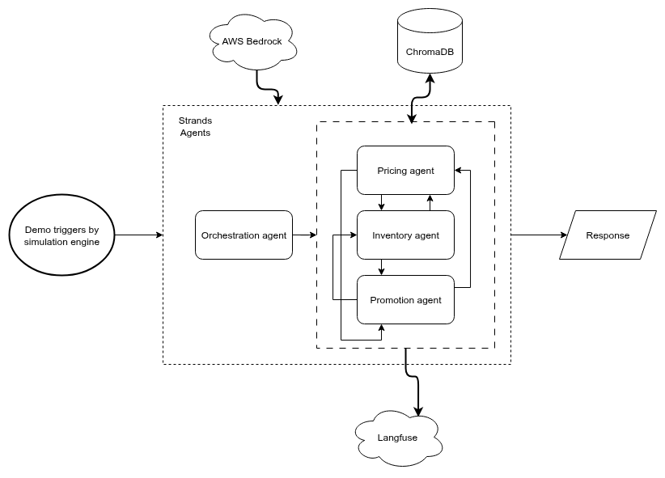

# AutoOps Retail Optimization



A multi-agent AI system for retail optimisation using AWS Strands Agents framework, powered by Amazon Nova Micro via AWS Bedrock.

## Overview

This system consists of three specialised AI agents (Pricing, Inventory, and Promotion) that collaborate to reduce waste and maximise profit through intelligent decision-making and real-time adaptations to market conditions.

## Architecture

- **AWS Strands Agents**: Multi-agent orchestration framework
- **Amazon Nova Micro**: LLM via AWS Bedrock
- **ChromaDB**: Vector database for agent memory
- **Langfuse**: Observability and tracing

## Prerequisites

- Python 3.9 or higher
- uv package manager
- AWS account with Bedrock access
- AWS credentials configured

## Installation

1. **Install uv** (if not already installed):
   ```bash
   curl -LsSf https://astral.sh/uv/install.sh | sh
   ```

2. **Clone and setup the project**:
   ```bash
   git clone <repository-url>
   cd autoops-retail-optimization
   ```

3. **Create virtual environment and install dependencies**:
   ```bash
   uv venv
   source .venv/bin/activate  
   uv sync 
   ```

4. **Configure environment variables**:
   ```bash
   cp .env.example .env
   # Edit .env with your AWS credentials and configuration
   ```

5. **Start simulation engine**:
   ```bash
   uv run main.py
   ```

## Configuration

### AWS Setup

1. **Enable AWS Bedrock access** for Amazon Nova Micro model in your AWS account
2. **Configure AWS credentials** in `.env` file or use AWS CLI/IAM roles
3. **Ensure proper IAM permissions** for Bedrock model access

### Environment Variables

Key configuration variables in `.env`:

- `AWS_REGION`: AWS region (default: us-east-1)
- `AWS_ACCESS_KEY_ID`: Your AWS access key
- `AWS_SECRET_ACCESS_KEY`: Your AWS secret key
- `BEDROCK_MODEL_ID`: Amazon Nova Micro model ID
- `CHROMADB_PERSIST_DIRECTORY`: Local directory for vector database
