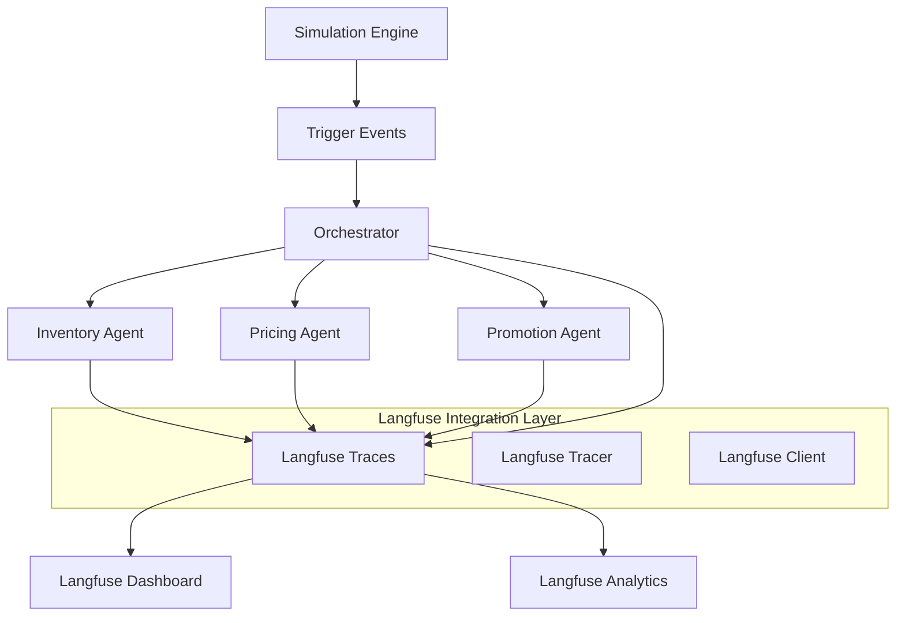

# Langfuse Integration Guide

## Overview

This comprehensive guide covers the Langfuse observability integration for the AutoOps Retail Optimization System. The integration provides real-time workflow visualization, agent performance monitoring, and comprehensive tracing of multi-agent decision-making processes.

## Architecture

### High-Level Architecture



### Integration Points

1. **Simulation Engine Triggers**: Capture simulation events as root traces
2. **Orchestrator Coordination**: Track inter-agent communication and workflow orchestration
3. **Agent Decision Making**: Trace individual agent reasoning and tool usage
4. **Agent Collaboration**: Monitor cross-agent workflows and conflict resolution
5. **Performance Metrics**: Aggregate system-wide performance data

## Core Components

### 1. Langfuse Integration Service

**Purpose**: Central service for managing Langfuse connections and trace coordination

**Key Features**:
- Connection management with automatic retry and fallback
- Trace lifecycle management (create, update, finalize)
- Context propagation across agent boundaries
- Performance monitoring and sampling

**Main Classes**:
- `LangfuseIntegrationService`: High-level service interface
- `LangfuseClient`: Low-level client wrapper with error handling
- `LangfuseConfig`: Configuration management
- `TraceManager`: Trace lifecycle coordination

### 2. Agent Instrumentation Layer

**Purpose**: Instrument existing agents with Langfuse tracing without modifying core logic

**Key Features**:
- `@observe` decorators for automatic tracing
- Context managers for manual trace control
- Tool-level tracing for detailed operation tracking
- Decision outcome logging with confidence scores

### 3. Simulation Event Tracer

**Purpose**: Capture simulation engine events as root traces for workflow visualization

**Key Features**:
- Event-to-trace mapping for different trigger types
- Trigger propagation tracking through the system
- Event finalization with outcome aggregation

### 4. Orchestrator Integration

**Purpose**: Trace orchestrator coordination and conflict resolution workflows

**Key Features**:
- Workflow coordination tracing
- Conflict detection and resolution monitoring
- Inter-agent communication tracking

## Data Models

### Trace Structure

```python
@dataclass
class SimulationTrace:
    trace_id: str
    event_type: str
    trigger_source: str
    start_time: datetime
    end_time: Optional[datetime]
    participating_agents: List[str]
    event_data: Dict[str, Any]
    outcome: Optional[Dict[str, Any]]

@dataclass
class AgentSpan:
    span_id: str
    agent_id: str
    operation_type: str
    parent_trace_id: str
    start_time: datetime
    end_time: Optional[datetime]
    inputs: Dict[str, Any]
    outputs: Dict[str, Any]
    tools_used: List[str]
    decision_confidence: Optional[float]

@dataclass
class CollaborationSpan:
    span_id: str
    workflow_type: str
    participating_agents: List[str]
    coordination_messages: List[Dict[str, Any]]
    conflicts_detected: List[Dict[str, Any]]
    resolution_outcome: Optional[Dict[str, Any]]
```

### Metrics Schema

```python
@dataclass
class AgentPerformanceMetrics:
    agent_id: str
    operation_count: int
    average_response_time: float
    success_rate: float
    tool_usage_stats: Dict[str, int]
    decision_accuracy: float
    collaboration_score: float

@dataclass
class SystemWorkflowMetrics:
    total_events_processed: int
    average_workflow_duration: float
    agent_coordination_efficiency: float
    conflict_resolution_rate: float
    system_throughput: float
```

## Configuration

### Environment Variables

```bash
# Required
LANGFUSE_PUBLIC_KEY=pk-lf-your_public_key_here
LANGFUSE_SECRET_KEY=sk-lf-your_secret_key_here

# Optional (with defaults)
LANGFUSE_HOST=https://cloud.langfuse.com
LANGFUSE_ENABLED=true
LANGFUSE_SAMPLE_RATE=1.0
LANGFUSE_DEBUG=false
LANGFUSE_FLUSH_INTERVAL=5.0
LANGFUSE_ENVIRONMENT=development
LANGFUSE_RELEASE=1.0.0
LANGFUSE_TRACING_ENABLED=true
LANGFUSE_MAX_LATENCY_MS=100
LANGFUSE_ENABLE_SAMPLING=true
LANGFUSE_BUFFER_SIZE=1000
LANGFUSE_MAX_RETRIES=3
```

### Configuration Classes

```python
@dataclass
class LangfuseConfig:
    public_key: str
    secret_key: str
    host: str = "https://cloud.langfuse.com"
    enabled: bool = True
    sample_rate: float = 1.0
    debug: bool = False
    flush_interval: int = 5
    max_retries: int = 3
    max_latency_ms: int = 100
    enable_sampling: bool = True
    buffer_size: int = 1000
    environment: str = "development"
    release: str = "1.0.0"
```

## Usage Examples

### Basic Integration Service Usage

```python
from config.langfuse_integration import get_langfuse_integration

# Get the integration service
service = get_langfuse_integration()

# Create a simulation trace
trace_id = service.create_simulation_trace({
    "event_type": "demand_spike",
    "trigger_source": "iot_sensor",
    "product_id": "PROD_123",
    "severity": "high"
})

# Start agent operations
inventory_span = service.start_agent_span(
    agent_id="inventory_agent",
    operation="forecast_demand",
    parent_trace_id=trace_id,
    inputs={"product_id": "PROD_123", "forecast_days": 7}
)

# Log agent decision
service.log_agent_decision("inventory_agent", {
    "decision_type": "restock_recommendation",
    "inputs": {"current_stock": 50, "forecast_demand": 150},
    "outputs": {"recommendation": "restock", "quantity": 100},
    "confidence": 0.85,
    "reasoning": "Demand forecast exceeds current stock"
})

# End agent operation
service.end_agent_span(inventory_span, {
    "status": "success",
    "forecast_result": "high_demand",
    "processing_time_ms": 150
})

# Finalize the trace
service.finalize_trace(trace_id, {
    "status": "completed",
    "agents_involved": 1,
    "total_processing_time_ms": 200
})
```

### Context Manager Usage

```python
# Automatic trace management with context managers
with service.trace_operation(
    "price_optimization",
    agent_id="pricing_agent",
    inputs={"product_id": "PROD_123", "current_price": 29.99}
) as trace_info:
    # Your operation code here
    optimal_price = calculate_optimal_price(product_id, current_price)
    
    # Trace is automatically finalized when exiting the context
```

### Collaboration Tracking

```python
# Track multi-agent workflows
collaboration_trace = service.track_collaboration(
    workflow_id="inventory_pricing_sync",
    participating_agents=["inventory_agent", "pricing_agent"],
    workflow_data={
        "trigger": "demand_spike",
        "priority": "high",
        "coordination_type": "sequential"
    }
)

# Log coordination messages
service.log_coordination_message(
    collaboration_trace,
    "inventory_agent",
    "pricing_agent",
    "demand_forecast_complete",
    {"forecast_demand": 150, "confidence": 0.85}
)
```

## Error Handling

### Error Categories

1. **Configuration Errors**: Invalid Langfuse credentials or connection issues
2. **Instrumentation Errors**: Failures in trace creation or span management
3. **Performance Errors**: High latency or resource consumption from tracing
4. **Data Errors**: Invalid trace data or serialization issues

### Error Handling Strategy

```python
class LangfuseErrorHandler:
    def handle_connection_error(self, error: Exception) -> None:
        # Graceful degradation - continue without tracing
        logger.warning(f"Langfuse connection failed: {error}")
        self.enable_fallback_mode()
    
    def handle_trace_error(self, trace_id: str, error: Exception) -> None:
        # Log error but don't interrupt agent operations
        logger.error(f"Trace {trace_id} failed: {error}")
        self.cleanup_failed_trace(trace_id)
    
    def handle_performance_degradation(self, latency_ms: float) -> None:
        # Implement sampling or disable tracing if performance impact is high
        if latency_ms > self.max_acceptable_latency:
            self.reduce_sampling_rate()
```

### Fallback Mechanisms

1. **Graceful Degradation**: System continues operating without tracing if Langfuse is unavailable
2. **Sampling**: Reduce trace volume if performance impact is detected
3. **Async Processing**: Use background queues for trace data to minimize impact on agent performance
4. **Local Buffering**: Buffer traces locally if Langfuse service is temporarily unavailable

## Performance Considerations

### Optimization Strategies

1. **Intelligent Sampling**: Configure sampling rates based on trace importance and system load
2. **Asynchronous Processing**: Process traces in background threads to avoid blocking operations
3. **Batch Processing**: Group multiple trace operations for efficient transmission
4. **Connection Pooling**: Reuse HTTP connections for improved performance

### Performance Monitoring

```python
# Monitor tracing performance
performance_metrics = service.get_performance_metrics()
print(f"Trace success rate: {performance_metrics['success_rate']}")
print(f"Average latency: {performance_metrics['avg_latency_ms']}ms")
print(f"Traces per second: {performance_metrics['throughput']}")
```

## Security Considerations

### Data Protection

1. **Credential Management**: Store Langfuse credentials securely using environment variables
2. **Data Privacy**: Implement data masking for sensitive information in traces
3. **Access Control**: Configure appropriate RBAC in Langfuse for different user roles
4. **Network Security**: Use HTTPS for all Langfuse communications
5. **Data Retention**: Configure appropriate data retention policies in Langfuse

### Privacy Features

```python
# Data masking configuration
@dataclass
class DataMaskingConfig:
    mask_pii: bool = True
    mask_financial_data: bool = True
    mask_customer_data: bool = True
    retention_days: int = 30
```

## Testing Strategy

### Unit Testing

1. **Integration Service Tests**: Test Langfuse client initialization and configuration
2. **Tracer Tests**: Verify trace creation, span management, and context propagation
3. **Error Handling Tests**: Test fallback mechanisms and error recovery
4. **Performance Tests**: Measure tracing overhead and latency impact

### Integration Testing

1. **Agent Integration Tests**: Verify tracing works with existing agent implementations
2. **Simulation Integration Tests**: Test end-to-end tracing from simulation events to agent decisions
3. **Dashboard Integration Tests**: Verify traces appear correctly in Langfuse dashboard
4. **Multi-Agent Workflow Tests**: Test complex collaboration scenarios

### Test Data Strategy

```python
class TestDataGenerator:
    def generate_simulation_event(self, event_type: str) -> Dict[str, Any]:
        return {
            "event_type": event_type,
            "trigger_source": "test_source",
            "product_id": f"PROD_{random.randint(100, 999)}",
            "timestamp": datetime.now().isoformat()
        }
    
    def generate_agent_decision(self, agent_id: str) -> AgentDecision:
        return AgentDecision(
            agent_id=agent_id,
            decision_type="test_decision",
            inputs={"test_input": "value"},
            outputs={"test_output": "result"},
            confidence=random.uniform(0.5, 1.0)
        )
```

## Monitoring and Alerting

### Key Metrics to Monitor

1. **Trace Success Rate**: Percentage of successfully created traces
2. **Tracing Latency**: Time overhead added by tracing operations
3. **Agent Performance Impact**: Change in agent response times with tracing enabled
4. **System Throughput**: Events processed per minute with tracing
5. **Error Rates**: Frequency of tracing errors or failures

### Alert Conditions

1. **High Latency**: Alert if tracing adds >100ms to agent operations
2. **Low Success Rate**: Alert if trace success rate drops below 95%
3. **Connection Issues**: Alert on Langfuse connectivity problems
4. **Performance Degradation**: Alert if system throughput drops >10%

## Deployment

### Installation

1. Install Langfuse Python SDK v3:
```bash
pip install langfuse>=3.0.0
```

2. Configure environment variables (see Configuration section)

3. Initialize the integration:
```python
from config.langfuse_integration import initialize_langfuse_integration

# Initialize during application startup
success = initialize_langfuse_integration()
if not success:
    logger.warning("Langfuse integration initialization failed - continuing in fallback mode")
```

### Health Checks

```python
# Perform health check
health_status = service.health_check()
if not health_status["available"]:
    logger.error("Langfuse service unavailable")
    # Implement fallback logic
```

## Troubleshooting

See the [Troubleshooting Guide](langfuse_troubleshooting_guide.md) for detailed troubleshooting information.

## Developer Guide

See the [Developer Guide](langfuse_developer_guide.md) for information on extending tracing to new agents and customizing the integration.

## Examples

See the `examples/` directory for comprehensive examples:

- `langfuse_integration_demo.py`: Basic integration demonstration
- `langfuse_foundation_demo.py`: Foundation service demonstration
- `error_handling_integration.py`: Error handling examples
- `metrics_collection_demo.py`: Performance metrics examples

## Support

For issues with Langfuse integration:

1. Check the [Langfuse Documentation](https://langfuse.com/docs)
2. Review application logs for error messages
3. Run the health check: `python scripts/deploy_langfuse.py --health-check`
4. Contact the development team

## Version History

- **v1.0.0**: Initial Langfuse v3 integration with basic tracing
- **v1.1.0**: Added performance monitoring and sampling
- **v1.2.0**: Enhanced error handling and fallback mechanisms
- **v1.3.0**: Added collaboration tracking and workflow visualization
- **v1.4.0**: Implemented data masking and security features