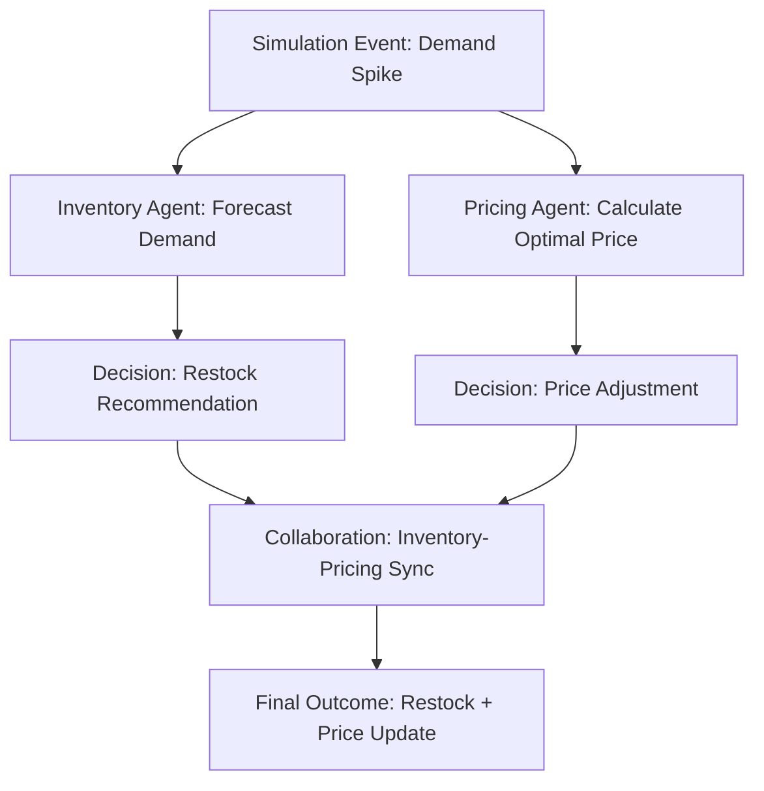
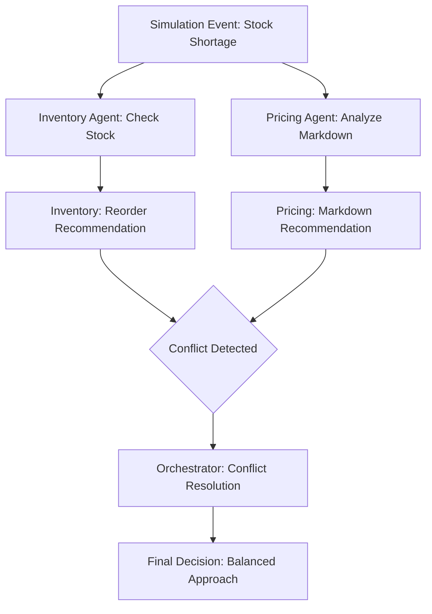

# Langfuse Workflow Examples and Trace Visualization Guide

## Overview

This guide provides comprehensive examples of how Langfuse traces are created and visualized for different workflow scenarios in the AutoOps Retail Optimization System. Each example shows the trace structure, key spans, and how to interpret the visualization in the Langfuse dashboard.

## Example 1: Demand Spike Response Workflow

### Scenario Description
A demand spike is detected by IoT sensors, triggering the inventory agent to forecast demand and the pricing agent to adjust prices accordingly.

### Trace Structure



### Sample Code

```python
from config.langfuse_integration import get_langfuse_integration
from datetime import datetime

service = get_langfuse_integration()

# 1. Create root trace for simulation event
trace_id = service.create_simulation_trace({
    "event_type": "demand_spike",
    "trigger_source": "iot_sensor",
    "product_id": "PROD_123",
    "severity": "high",
    "location": "store_001",
    "timestamp": datetime.now().isoformat(),
    "sensor_data": {
        "current_demand": 150,
        "baseline_demand": 100,
        "spike_duration_minutes": 30
    }
})

# 2. Inventory agent forecasts demand
inventory_span = service.start_agent_span(
    agent_id="inventory_agent",
    operation="forecast_demand",
    parent_trace_id=trace_id,
    inputs={
        "product_id": "PROD_123",
        "forecast_horizon_days": 7,
        "historical_data_days": 30,
        "current_stock": 50
    }
)

# Simulate demand forecasting calculation
forecast_demand = 150  # units per day
confidence = 0.85

service.log_agent_decision("inventory_agent", {
    "decision_type": "demand_forecast",
    "inputs": {"product_id": "PROD_123", "forecast_days": 7},
    "outputs": {"forecast_demand": forecast_demand, "confidence": confidence},
    "reasoning": "Seasonal trend analysis with 85% confidence",
    "tools_used": ["demand_forecaster", "trend_analyzer"]
})

service.end_agent_span(inventory_span, {
    "status": "success",
    "forecast_result": "high_demand",
    "processing_time_ms": 150,
    "confidence_score": confidence
})

# 3. Pricing agent calculates optimal price
pricing_span = service.start_agent_span(
    agent_id="pricing_agent",
    operation="calculate_optimal_price",
    parent_trace_id=trace_id,
    inputs={
        "product_id": "PROD_123",
        "current_price": 29.99,
        "forecast_demand": forecast_demand,
        "competitor_prices": [27.99, 31.99, 28.99],
        "elasticity_factor": 1.2
    }
)

# Simulate price optimization calculation
optimal_price = 31.99
price_change = 2.00

service.log_agent_decision("pricing_agent", {
    "decision_type": "price_optimization",
    "inputs": {
        "current_price": 29.99,
        "forecast_demand": forecast_demand,
        "competitor_analysis": "competitive_positioning"
    },
    "outputs": {
        "recommended_price": optimal_price,
        "price_change": price_change,
        "strategy": "demand_based_pricing"
    },
    "confidence": 0.92,
    "reasoning": "High demand forecast justifies 6.7% price increase",
    "tools_used": ["price_optimizer", "competitor_analyzer", "elasticity_calculator"]
})

service.end_agent_span(pricing_span, {
    "status": "success",
    "optimal_price": optimal_price,
    "price_change": price_change,
    "processing_time_ms": 200,
    "confidence_score": 0.92
})

# 4. Track collaboration between agents
collaboration_trace = service.track_collaboration(
    workflow_id="demand_spike_response",
    participating_agents=["inventory_agent", "pricing_agent"],
    workflow_data={
        "trigger": "demand_spike",
        "coordination_type": "sequential",
        "priority": "high"
    }
)

# Log coordination messages
service.log_coordination_message(
    collaboration_trace,
    "inventory_agent",
    "pricing_agent",
    "demand_forecast_complete",
    {
        "forecast_demand": forecast_demand,
        "confidence": confidence,
        "recommended_action": "price_increase"
    }
)

service.log_coordination_message(
    collaboration_trace,
    "pricing_agent",
    "inventory_agent",
    "price_optimization_complete",
    {
        "optimal_price": optimal_price,
        "price_change": price_change,
        "strategy": "demand_based_pricing"
    }
)

# 5. Finalize traces
service.finalize_trace(trace_id, {
    "status": "completed",
    "agents_involved": 2,
    "total_processing_time_ms": 350,
    "outcome": {
        "restock_recommended": True,
        "restock_quantity": 100,
        "price_updated": True,
        "new_price": optimal_price
    }
})

service.finalize_trace(collaboration_trace, {
    "status": "successful",
    "resolution": "coordinated_response",
    "coordination_efficiency": 0.95
})
```

### Dashboard Visualization

In the Langfuse dashboard, this workflow appears as:

1. **Root Trace**: `demand_spike` with metadata showing trigger source and severity
2. **Child Spans**:
   - `inventory_agent:forecast_demand` - Shows input parameters and forecast results
   - `pricing_agent:calculate_optimal_price` - Displays price optimization details
3. **Collaboration Trace**: Shows inter-agent communication flow
4. **Timeline View**: Visual representation of execution sequence and timing

### Key Metrics to Monitor

- **Response Time**: Total time from trigger to final decision (< 500ms target)
- **Agent Coordination**: Number of coordination messages exchanged
- **Decision Confidence**: Average confidence scores across agents
- **Success Rate**: Percentage of successful demand spike responses

## Example 2: Multi-Agent Conflict Resolution

### Scenario Description
Inventory and pricing agents have conflicting recommendations, requiring orchestrator intervention to resolve the conflict.

### Trace Structure



### Sample Code

```python
# Create root trace
trace_id = service.create_simulation_trace({
    "event_type": "stock_shortage",
    "trigger_source": "inventory_system",
    "product_id": "PROD_456",
    "severity": "medium",
    "current_stock": 10,
    "reorder_point": 50
})

# Inventory agent span
inventory_span = service.start_agent_span(
    agent_id="inventory_agent",
    operation="check_inventory_levels",
    parent_trace_id=trace_id,
    inputs={"product_id": "PROD_456", "current_stock": 10}
)

service.log_agent_decision("inventory_agent", {
    "decision_type": "reorder_recommendation",
    "inputs": {"current_stock": 10, "reorder_point": 50},
    "outputs": {"recommendation": "immediate_reorder", "quantity": 100},
    "confidence": 0.95,
    "reasoning": "Stock below reorder point by 40 units"
})

service.end_agent_span(inventory_span, {
    "status": "success",
    "recommendation": "immediate_reorder",
    "quantity": 100
})

# Pricing agent span
pricing_span = service.start_agent_span(
    agent_id="pricing_agent",
    operation="analyze_markdown_opportunity",
    parent_trace_id=trace_id,
    inputs={"product_id": "PROD_456", "current_price": 39.99}
)

service.log_agent_decision("pricing_agent", {
    "decision_type": "markdown_recommendation",
    "inputs": {"current_price": 39.99, "market_conditions": "slow_moving"},
    "outputs": {"recommendation": "markdown", "discount_percentage": 25},
    "confidence": 0.88,
    "reasoning": "Product in slow-moving category, markdown will stimulate sales"
})

service.end_agent_span(pricing_span, {
    "status": "success",
    "recommendation": "markdown",
    "discount_percentage": 25
})

# Conflict detection and resolution
conflict_span = service.start_agent_span(
    agent_id="orchestrator",
    operation="detect_conflicts",
    parent_trace_id=trace_id,
    inputs={
        "agent_decisions": [
            {"agent": "inventory_agent", "action": "reorder", "quantity": 100},
            {"agent": "pricing_agent", "action": "markdown", "discount": 25}
        ]
    }
)

# Log conflict details
service.log_conflict_detection(conflict_span, {
    "conflict_type": "strategy_conflict",
    "conflicting_agents": ["inventory_agent", "pricing_agent"],
    "conflict_description": "Inventory wants to reorder while pricing wants to markdown",
    "severity": "medium"
})

# Resolution process
service.log_conflict_resolution(conflict_span, {
    "resolution_strategy": "compromise",
    "resolution_details": "Reduce reorder quantity and apply smaller markdown",
    "final_decision": {
        "reorder": True,
        "reorder_quantity": 60,
        "markdown": True,
        "discount_percentage": 15
    }
})

service.end_agent_span(conflict_span, {
    "status": "resolved",
    "resolution_time_ms": 75,
    "resolution_confidence": 0.90
})

# Finalize trace
service.finalize_trace(trace_id, {
    "status": "completed",
    "conflicts_resolved": 1,
    "final_outcome": {
        "reorder_quantity": 60,
        "discount_percentage": 15,
        "compromise_achieved": True
    }
})
```

### Dashboard Visualization

**Conflict Resolution View**:
- Red spans indicate conflicts detected
- Yellow spans show resolution process
- Green spans indicate successful resolution
- Timeline shows resolution time and sequence

## Example 3: Performance Benchmarking Workflow

### Scenario Description
System performance testing with multiple concurrent workflows to measure throughput and latency.

### Sample Code

```python
import asyncio
import time
from concurrent.futures import ThreadPoolExecutor

async def benchmark_workflow(service, workflow_id: int):
    """Simulate a complete workflow for benchmarking."""
    start_time = time.time()

    # Create trace
    trace_id = service.create_simulation_trace({
        "event_type": "benchmark_test",
        "workflow_id": workflow_id,
        "test_type": "concurrent_workflows"
    })

    # Simulate agent operations
    tasks = []

    # Inventory agent task
    inventory_task = asyncio.create_task(
        simulate_inventory_operation(service, trace_id, workflow_id)
    )
    tasks.append(inventory_task)

    # Pricing agent task
    pricing_task = asyncio.create_task(
        simulate_pricing_operation(service, trace_id, workflow_id)
    )
    tasks.append(pricing_task)

    # Promotion agent task
    promotion_task = asyncio.create_task(
        simulate_promotion_operation(service, trace_id, workflow_id)
    )
    tasks.append(promotion_task)

    # Wait for all agents to complete
    await asyncio.gather(*tasks)

    # Finalize trace
    processing_time = (time.time() - start_time) * 1000
    service.finalize_trace(trace_id, {
        "status": "completed",
        "total_processing_time_ms": processing_time,
        "agents_involved": 3,
        "concurrent_operations": True
    })

    return processing_time

async def simulate_inventory_operation(service, trace_id, workflow_id):
    """Simulate inventory agent operation."""
    span_id = service.start_agent_span(
        agent_id="inventory_agent",
        operation="benchmark_forecast",
        parent_trace_id=trace_id,
        inputs={"workflow_id": workflow_id, "test_data": "benchmark"}
    )

    # Simulate processing time
    await asyncio.sleep(0.1)

    service.end_agent_span(span_id, {
        "status": "success",
        "processing_time_ms": 100,
        "test_result": "passed"
    })

# Similar functions for pricing and promotion agents...

async def run_benchmark(service, num_workflows: int = 10):
    """Run concurrent workflow benchmark."""
    print(f"Running benchmark with {num_workflows} concurrent workflows...")

    start_time = time.time()

    # Create concurrent workflow tasks
    tasks = [
        benchmark_workflow(service, i)
        for i in range(num_workflows)
    ]

    # Execute all workflows concurrently
    processing_times = await asyncio.gather(*tasks)

    total_time = time.time() - start_time

    # Calculate metrics
    avg_processing_time = sum(processing_times) / len(processing_times)
    throughput = num_workflows / total_time

    print("Benchmark Results:")
    print(f"  Total workflows: {num_workflows}")
    print(f"  Total time: {total_time".2f"}s")
    print(f"  Average processing time: {avg_processing_time".2f"}ms")
    print(f"  Throughput: {throughput".2f"} workflows/second")

    return {
        "total_workflows": num_workflows,
        "total_time": total_time,
        "avg_processing_time": avg_processing_time,
        "throughput": throughput
    }
```

### Dashboard Visualization

**Performance Dashboard**:
- Throughput metrics over time
- Average latency per workflow type
- Error rates and failure analysis
- Resource utilization trends

## Example 4: Error Handling and Recovery

### Scenario Description
An agent encounters an error and demonstrates recovery mechanisms.

### Sample Code

```python
# Create trace with error scenario
trace_id = service.create_simulation_trace({
    "event_type": "error_recovery_test",
    "test_scenario": "agent_failure_recovery"
})

# Simulate agent operation with error
agent_span = service.start_agent_span(
    agent_id="pricing_agent",
    operation="price_calculation",
    parent_trace_id=trace_id,
    inputs={"product_id": "PROD_ERROR", "base_price": 29.99}
)

try:
    # Simulate an error condition
    raise ValueError("Invalid price data received")

except Exception as e:
    # Log the error in the trace
    service.log_error(agent_span, {
        "error_type": "ValueError",
        "error_message": str(e),
        "error_context": {
            "operation": "price_calculation",
            "product_id": "PROD_ERROR",
            "input_data": {"base_price": 29.99}
        },
        "recovery_attempted": True
    })

    # Attempt recovery
    service.log_recovery_attempt(agent_span, {
        "recovery_strategy": "use_default_price",
        "fallback_price": 25.99,
        "recovery_success": True
    })

    service.end_agent_span(agent_span, {
        "status": "recovered",
        "error_occurred": True,
        "recovery_successful": True,
        "final_price": 25.99
    })

# Finalize trace
service.finalize_trace(trace_id, {
    "status": "completed_with_recovery",
    "errors_encountered": 1,
    "recovery_successful": True,
    "final_outcome": "used_fallback_pricing"
})
```

### Dashboard Visualization

**Error Analysis View**:
- Error frequency by agent and operation type
- Recovery success rates
- Error patterns and trends
- Performance impact of errors

## Dashboard Views and Filters

### Key Dashboard Views

1. **Workflow Timeline**: Chronological view of all traces and spans
2. **Agent Performance**: Performance metrics by agent type
3. **Error Analysis**: Error patterns and recovery statistics
4. **Collaboration Graph**: Inter-agent communication flows
5. **Performance Trends**: Throughput and latency over time

### Useful Filters

- **Time Range**: Last hour, day, week, or custom range
- **Agent Type**: Filter by specific agent (inventory, pricing, promotion)
- **Operation Type**: Filter by operation (forecast, price_calculation, etc.)
- **Status**: Filter by success, error, or recovery status
- **Trace Type**: Filter by simulation event type

### Custom Dashboards

You can create custom dashboard views in Langfuse:

```json
{
  "name": "Retail Optimization Overview",
  "widgets": [
    {
      "type": "trace_timeline",
      "title": "Recent Workflows",
      "filters": {
        "time_range": "last_24_hours",
        "agent_types": ["inventory_agent", "pricing_agent", "promotion_agent"]
      }
    },
    {
      "type": "metrics_chart",
      "title": "Agent Performance",
      "metrics": ["avg_response_time", "success_rate", "throughput"]
    }
  ]
}
```

## Best Practices for Trace Visualization

1. **Consistent Naming**: Use consistent operation names and agent IDs
2. **Rich Metadata**: Include relevant context in trace metadata
3. **Error Context**: Always include error details and recovery information
4. **Performance Metrics**: Track timing and resource usage
5. **Collaboration Tracking**: Log all inter-agent communications
6. **Regular Review**: Regularly review traces to identify optimization opportunities

## Troubleshooting Visualization Issues

If traces don't appear in the dashboard:

1. Check Langfuse connection status
2. Verify trace IDs are being generated correctly
3. Ensure spans have valid parent trace IDs
4. Check for sampling configuration issues
5. Review error logs for trace creation failures

For detailed troubleshooting, see the [Troubleshooting Guide](langfuse_troubleshooting_guide.md).